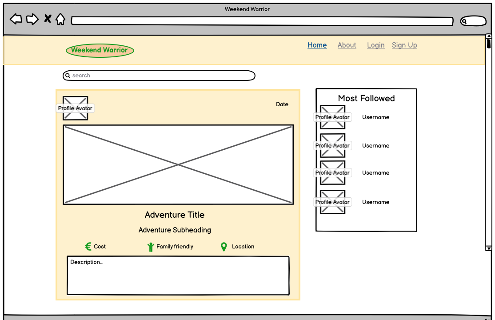
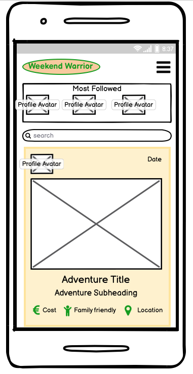
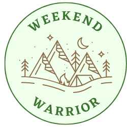
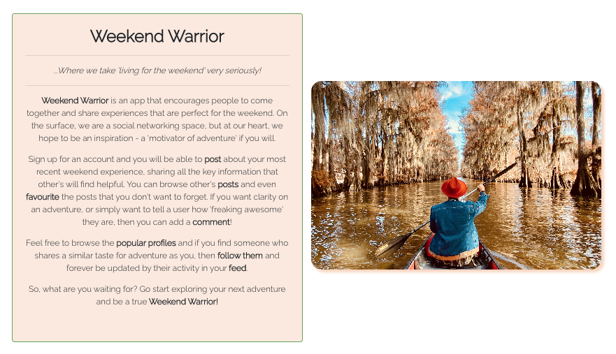
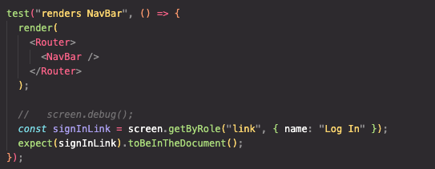
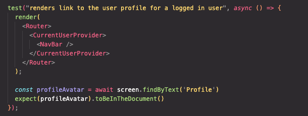
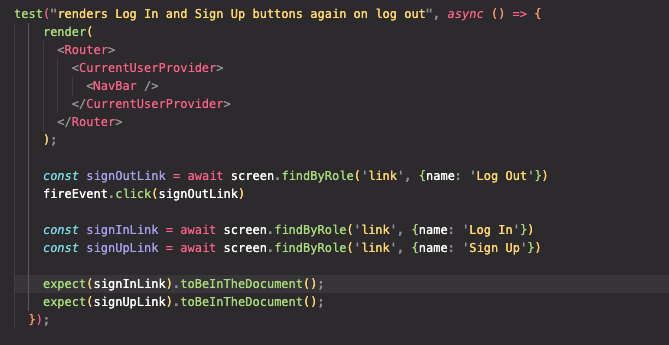
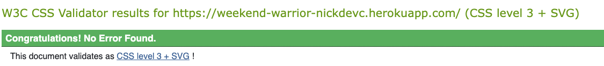
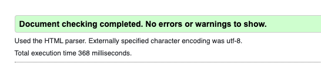

<h1 align="center">:evergreen_tree: Weekend Warrior :evergreen_tree:</h1>
<h3 align="center"><i>Where we take "living for the weekend" very seriously!</i></h3>

## Important links

[Deployed API](https://weekend-warrior-api.herokuapp.com)

[Deployed App](https://weekend-warrior-nickdevc.herokuapp.com)

[Front-end Repository](https://github.com/NickdevC/weekend-warrior-react/)

[API Repository](https://github.com/NickdevC/ww-api)

## Contents

*  [Purpose](#purpose)
*  [User Experience](#user-experience)
*  [Design](#design)
*  [Technologies Used](#technologies-used)
*  [Testing](#testing)
*  [Deployment](#deployment)
*  [Credits](#credits)

# Purpose

After noticing a number of posts from people in my local community on Facebook relating to weekend activities for their respective families, it struck me about how there was a gap in demand for a social space purely dedicated to finding and sharing these experiences. Whilst current social media spaces do offer the ability for users to share this type of content, it is often lost in the 'noise' of these existing sites, who's purpose is much more generic and broad. In order to filter through results and specify only those posts that related to experiences/adventures would be tedious and not always accurate. I also felt that, whilst the more established and well-known activites are often publicised widely, the lesser-known local opportunities remain quite niche and rely on word-of-mouth. That is where Weekend Warrior comes in!

With Weekend Warrior, users visit the app purely for the purposes of sharing and discovering potentially new and exciting adventures to occupy their weekend. On opening the app, users are greeted with a live feed of all current posts - a tantelising preview of the exciting user experience they can explore! Much like current social media platforms, the site is designed to keep users engaged with infinite scrolling and features such as the ability to: favourite, comment and follow. Users' posts (or `adventures` as they are known on the app) are broken down into fields that have been designed to suit the specific purposes of helping others make informed choices about whether an adventure is a 'good fit' for them. In this respect, Weekend Warrior differs from other social media platforms, as it truly encourages users to take their time when filling out posts - this information becomes meaningful tools for others. The hope is that Weekend Warrior brings together people to form a meaningful community focussed on getting outside and truly 'living for the weekend'!

# User Experience

## Objectives of the Project:

1. To produce the **MVP** (minimum viable product), that allows `users` to interact with each other in a shared social space, united by and interest in making the most of their free time.
2. To enable `users` to register `profiles` which gives them wider opportunities on the app to socialise.
3. To allow `registered users` to **create**, **read**, and **edit** their `profile` information.
4. To allow `registered users` to **post** `adventures`, using a custom set of perameters to guide their content. They also have the ability to **edit** and **delete** these posts.
5. To enable `registered users` to interact with other `users'` content by `favouriting` and `commenting` on these - having this content displayed in a personalised way through the navigation menu.
6. To ensure that each `user` has the autonomy to choice who they wish to `follow`, building a network of like-minded personalities. 

## Target Audience

I feel the target audience for the app is most likely **parents** and **adults**. This is purely because the social media space for younger age groups is already very well occupied, and the activites encouraged on Weekend Warriors do not currently appeal to many younger people. Having said that, apps like Weekend Warriors are 'organic beasts' in many ways, and this app is no different - it can evolve and change depending on the type of engagement it generates.

### Audience needs:
- **Simple design** - focussing on being a welcoming space whilst not detracting from the main purposes of the site.
- **Accessibility** - simple navigation, supported by minimal user steps to accomplish goals.
- **Communication** - clear and present feedback to reassure the user of their actions and success with achieving goals.
- **Rapid engagement** - delivering content quickly and limitlessly.
- **Sociability** - a focus on communicating with others and engaging in social feedback.
- **Security** - reassurance that personal information is not shared, and a user's posts are their own.

## Functionality Requirements

All `user stories` can be viewed in this project's [kanban board](https://github.com/users/NickdevC/projects/5), where all issues are clearly labelled and categorised to give context.

As well as User Stories, I have included Tasks detailing specific development jobs that relate to setting up the working environment. In addition, all 'could have' User Stories have been moved to a column in the kanban board for 'future features'. If I had more time, those are the features I would focus on implementing first.

[Return to contents](#contents)

# Design

## Agile Approach

I followed the 'agile' approach to developing Weekend Warriors, using the content from Code Institute's course content to support me. Initially, I used the Github 'issues' feature to create my `Must Have` features (displayed as user stories). Once these were established, and with consideration to my project's timeline, I considered and added a number of `Could Have` features that were not essential for the **MVP**. In addition, I created a [kanban board](https://github.com/users/NickdevC/projects/5) which I used throughout the development process. Whilst working through sprints, and ensuring I met the criteria for various user stories, I found it useful to create 'Tasks' to detail specifc, more developmental jobs.

Whilst the agile approach itself is more commonly based in team environments, with multiple people working on a project, this was hard to achieve as my project was **my** sole responsibility. To attempt to combat this 'coding in isolation', I reached out to a number of other people within the community to collaborate by: reviewing code, discussing bugs, problem solving user features and giving regular progress updates. The details of these collaborators can be found in the [Acknowledgements](#acknowledgements) section at the bottom of this readme.

[Return to contents](#contents)

## Technical Design

### Data Structure (models)

All of the data structuring was completed when creating my backend API. The repository and accompanying README can be found here: [ww-api](https://www.github.com/NickdevC/ww-api) 

[Return to contents](#contents)

## UI Design

### Wireframes

### Colour

* I decided to keep the colour scheme very simple and primarily focussed on natural colours. The main palette is a spectrum of warm brown tones, maintaining an earthy-feel and linking to the overall message of 'adventure' that the app is designed to inspire. The green tone adds accents to certain features and provides contrast to interactive elements so that users get enough feedback. There is clear consistency across the app, and the colours can also be seen within the logo itself.

### Typography

* In keeping with the themes of 'nature' and 'simplicity', I felt that the 'Raleway' font was most appropriate for the majority of the app. In many ways, the font is very 'wooden' and 'stick-like', mimicking the branding I was attempting to potray with the unique logo.

[Return to contents](#contents)

### Logo

* Using the [Canva](https://www.canva.com/icons/) website, I worked on designing a personal logo to reflect the Warrior Weekend brand. It needed to portray a sense of the 'great outdoors' whilst maintaining consistency with the colour scheme present throughout the rest of the app. By using Canva, I was also able to make quick adjustments and edits, meaning that it was simple to alter the logo to suit other purposes (like the 'not found' message displayed to users). Whilst I would have loved to have spent more time on the design process, I was happy with how this turned out.

#### Main Logo

#### Favicon

#### Not Found (variation)

### Features 
---

#### Navbar

* The navbar includes simple branding, in the form of the website logo (situated at the upper-left-corner). It is fully responsive and reduces to a 'burger menu' when screen size is reduced. When a user first visits the app, they are able to see: Home, About, Login, and Sign Up links.

#### About

* The 'About' page is accessible by all users (regardless of whether they are registered), and provides information about the purpose and functionality of the site. It makes the user journey clear and hopefully encourages users to sign up!

#### Sign Up 

* The 'Sign Up' page is simple in design and is accompanied by an image that invokes enthusiasm and adventure. Users are actively challenged with authrorization checks to ensure there is no repeated data and that the strength of credentials are good.

#### Log In

* Users are automatically redirected here after 'signing up'. It is simple and responsive.

#### Home Feed

* All users will be able to see the home feed - an infinitely scrolling wall of adventures! A similar experience is seen in the 'favourites' and 'feed' navbar links, however these are tailored to only show `favourited` and `followed` adventures respectively.

#### Adventures (posts)

* The adventure posts themselves are big and bold. With a large space for a user-uploaded image, they also allow for users to select key field parameters and have them display to other users. A key goal with Weekend Warriors is that these adventure posts are helpful to others and give other users as much information as possible in asimple and accessible manner. It is also here where logged in users can click on the 'heart' icon to favourite an adventure.

#### Most Followed Users

* This seperate container encourages users to click on other profiles and begin increasing their online social circle by following them. The 'follow/unfollow' function is seamless and changed at the click of a button.

#### Profiles

* The profiles page provides a more detailed view of an individual user. Not only does it allow for other users to follow the profile, but it also display some key information about the user, helping others make an informed choice when deciding who to follow. The profile can also be edited by the owner from here (including changing their profile image).

#### Edit Username/Password

* Within the profile page, owners can easily edit their username and/or password. Once complete, they are redirected back.

#### Create Adventure (post)

* The all important 'adventure post' is created here. Users are encouraged to fill out a number of key fields to provide a great deal of information to other users with minimal effort ont heir part. In addition, they are given the chance to be more free and creative by having the option of filling out a detailed description textarea.

#### Comments

* All logged in users are able to click on an adventure and add their own comment, encouraging users to enter in a shared dialogue with each other.

#### Searchbar

* This feature allows users to type in any combination of letters to find key words within the adventure posts. It will retrieve adventures that have matching words in their: titles, username or content.

#### Spinner

* This asset is present throughout the app, and will always render when components are loading to give the user clear feedback and reassure them that the app is working. 

#### Dropdown Menu

* This asset is featured in the profile, comments and adventures, to allow users to gain a greater level of access to their own content. Provide them with the ability to edit and, the case of the comments and adventures, delete their content.

#### Potential Future Features

* The ability for users to comment on existing comments, creating mini threads within an adventure post
* The ability for users to comment using images of their own

[Return to contents](#contents)

# Technologies Used 

## Languages
* HTML
* CSS
* JSX
* Javascript

## Frameworks/libraries
* Django Rest Framework - back end API
* React.JS - All components used to create and render the front-end
* React Bootstrap - Provided additional styling options
* Gitpod - CLI workspace
* Github - Hosting platform for repository
* Heroku - Used to host and deploy the live app

## Databases
* ElephantSQL - Database used to store all models and user-generated data.
* Cloudinary - Cloud database for storing images and uploaded files from the front-end of my app.

## Other Tools
* Pip3 - The package installer for Python, used to install packages from the Python Package Index and other indexes.
* Gunicorn - Gunicorn 'Green Unicorn' is a Python WSGI HTTP Server for UNIX (translates HTTP requests for Python to understand).
* Pyscopg2 - PostgreSQL database adapter for Python.
* VScode - A code editor redefined and optimized for building and debugging modern web and cloud applications. 
* Chrome Dev Tools - A set of web developer tools built directly into the Google Chrome browser. Used to help debug my code during development.
* Google Fonts - A font catalogue, providing a variety of free custom fonts.
* Font Awesome - An online icon library, used to provide small icons for social links and navigation functions.
* Coolors - Used to research colours and create a palette for the project.
* Balsamiq - Used to create wireframes of the site during planning stages.
* Favicon - Used to create favicon for app.
* AmIResponsive - Used to check responsiveness on multiple devices.
* DrawSQL - Used to create and display model structures.
* Canva - Used to design to appp logo

[Return to contents](#contents)

# Testing

## Unit Testing (automated)

I carried out some automated testing on the NavBar component, following test protocols of making the tests fail in the first instance and then ensuring they pass. This is an area where I feel least confident and would have like to have spent more time exploring if time was not such an issue.

## User Testing (manual)

| Feature | User Action | Outcome |
| ----- | -------- | ------- |
| Navigation | As a logged out user, I can see the 'home', 'log in', 'sign up', and 'about' links | PASS |
| Navigation | As a logged in user, I can see the 'home', 'about', 'feed', 'favourites' and 'add adventure', links | PASS |
| Navigation | As a logged in user, I can see my profile avatar displayed in the navbar | PASS |
| Navigation | As a logged out user, if I click on a restricted feature, I cam redirected to the homepage | PASS |
| About Page | As a user, I can view the About page and it's contents | PASS |
| Home | As a user, I can see all adventure posts and scroll through them with infinite scroll enabled | PASS |
| Home | As a user, I can see all 'most followed' profiles | PASS |
| Home | As a user, I can click on an adventure post to see it's details | PASS |
| Home | As a user, I can click on a profile to see more details about that user and their adventure posts | PASS |
| Adventure Post | As a user, I can see all comments attached to an adventure post | PASS |
| Adventure Post | As a logged in user, I can add comments to an adventure post | PASS |
| Adventure Post | As a logged in user, I can favourite/unfavourite an adventure post | PASS |
| Comments | As an owner of a comment, I can edit/delete my comment | PASS |
| Comments | As a user, I can view the avatar associated with each comment and the date it was made | PASS |
| Favourites Page | As a logged in user, my favourited posts are displayed in my favourites page (navbar) | PASS |
| Profile Page | As a user, I can see all of a user's statistics | PASS |
| Profile Page | As a user, I can see all adventure posts linked to the specific profile I am viewing | PASS |
| Profile Page | As a logged in user, follow a profile from their profile page | PASS |
| Profile Page | As an owner of a profile, I can edit my profile and update my username/password | PASS |
| Follow/unfollow | As a logged in user, I can follow/unfollow profiles | PASS |
| Feed Page | As a logged in user, I can view all adventure posts from those I follow in the 'Feed' page | PASS |
| Refresh Tokens | As a logged in user, I continue to have access to my content over time without having to log back in each visit | PASS |

## Performance Testing

### HTML Validation

### CSS

### Python

**Note - PEP8 no longer offers their validation services**

With 'pycodestyle' installed in my workspace, I was able to see and correct errors within my code (mainly pertaining to lengthy lines). I am satisfied that those errors have now been resolved.

### Responsive Testing

The website has been tested using the following browsers:

- Google Chrome
- Microsoft Edge
- Mozilla Firefox
- Safari

The website has been tested on the following devices: 

- MacBook Air
- Apple Ipad
- Huwawei p20

During testing it was found that some users were unable to log in if using Firefox or Safari. Turning off “Prevent Cross-Site Tracking” in the browser settings, seems to fix this issue.

## Bugs

During the development process and through consistent user testing, I was able to identify and find solutions to a number of bugs. Engaging with fellow Code Institue students (see 'Credits') I was able to recieve regular user feedback and work on solutions in a timely manner.

| Location/feature | Description | Solution |
| ----- | -------- | ------- |
| Navlink (i elements) | On 'hover', these elements remained blue from the CI boilerplate css. I could not overide them. | Explored inheritance, and altered this to target the specific element. |
| profile_image (avatar) | Image was not displaying correctly (showing broken link). | User serializer path was incorrect, it was `profile.image.url` and needed to be `profile.profile_image.url` |
| Creating an adventure post | Trying to include a '<' symbol within text fields. It would not allow me to do this and it would throw the rest of the code. | Researching on w3schools, I realised I needed to use HTML entities, specifically `&lt;` |
| Submitting an adventure post | I kept receiving a `CORS error` and the form would not submit. | I went to the try/catch block in the function and realised the axios key had the wrong url path, it needed to be `/adventures/` rather than `/posts/` |
| Post.js | Some font awesome logos refused to render and were not displaying properly when inspecting in dev tools. | Checked my version of FA and realised I needed to use an older version. Imported those versions, and all icons rendered. |
| PostPage.js | The adventure posts were not displaying the 1st option in the option fields from the adventures model. It kept returning as 'none'. | I added an additional 1st option to the return statement, as a placeholder of '-'. That way if the user decided to leave the field blank, '-' would display. |
| ProfilePage.js | The page was not displaying any of the counts for: followers, following or adventure posts. | On investigating, and with the support of the Slack community, I was able to see that I had made an error back in my API. The views.py for my profiles had a duplicate `queryset` statement that was cancelling out the request. |

[Return to contents](#contents)

## Future Features

If I were to have more time on the project I would consider implementing the following features:
* Added a 'Contact form' for users to contact the website administrators.
* The ability for users to comment on others' comments, creating threads of conversations.
* A rating system in the adventures model, to allow users to cast their star rating on an adventure post.

# Deployment

## Forking the GitHub Repository

1. Go to [the project repository](https://github.com/NickdevC/weekend-warrior-react)
2. In the right most top menu, click the "Fork" button.
3. There will now be a copy of the repository in your own GitHub account.

## Running the project locally

1. Go to [the project repository](https://github.com/NickdevC/weekend-warrior-react)
2. Click on the "Code" button.
3. Choose one of the three options (HTTPS, SSH or GitHub CLI) and then click copy.
4. Open the terminal in you IDE program.
5. Type `git clone` and paste the URL that was copied in step 3.
6. Press Enter and the local clone will be created.

### Alternatively by using Gitpod:

1. Go to [the project repository](https://github.com/NickdevC/weekend-warrior-react)
2. Click the green button that says "Gitpod" and the project will now open up in Gitpod.

## Deploying with Heroku

1. Go to [Heroku.com](https://dashboard.heroku.com/apps) and log in; if you do not already have an account then you will need to create one.
2. Click the `New` dropdown and select `Create New App`.
3. Enter a name for your new project, all Heroku apps need to have a unique name, you will be prompted if you need to change it.
4. Select the region you are working in.

### Heroku Deployment

In the Deploy tab:

1. Connect your Heroku account to your Github Repository following these steps:
   - Click on the `Deploy` tab and choose `Github-Connect to Github`.
   - Enter the GitHub repository name and click on `Search`.
   - Choose the correct repository for your application and click on `Connect`.
2. You can then choose to deploy the project manually or automatically, automatic deployment will generate a new application every time you push a change to Github, whereas manual deployment requires you to push the `Deploy Branch` button whenever you want a change made.
3. Once you have chosen your deployment method and have clicked `Deploy Branch` your application will be built and you should now see the `View` button, click this to open your application.

# Credits

## Websites

* [Pixabay](https://pixabay.com/) - Stock images were used for the app design and for profile images.
* [React Bootstrap Docs](https://react-bootstrap-v4.netlify.app/) - The official docs for React Bootstrap components.
* [Stack Overflow](https://stackoverflow.com/) - Supported me in understanding: try/catch blocks, Routes in React, and adding custom fields to models in Django Rest.

## Acknowledgements

* The Code Institute walkthrough project 'Moments' for providing some structure and direction for my personal project.
* My mentor Martina Terlevic who has accomodated me along the way, supporting with queries 'on the fly' and providing invaluable guidance during project milestone meetings. 
* Code Institute tutors for helping to guide me through some difficult debugging (this process was often what caused the most retained learning for me).
* I also want to thank [Chris.F](https://github.com/Chrisfaherty) and [Chris.B](https://github.com/Christoph33one) (fellow Code Institute students). By joining together and engaging in remote study sessions your conversation and input kept me on track and motivated to push myself with regards to the project. Constructive venting and questioning, both contributed to much needed progress!

[Deployed Live Site](https://weekend-warrior-nickdevc.herokuapp.com/)

[Return to contents](#contents)
