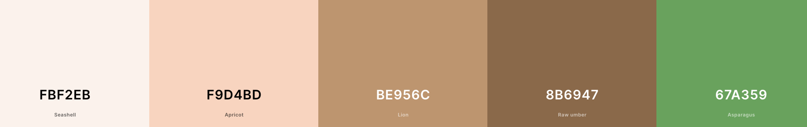

<h1 align="center">:evergreen_tree: Weekend Warrior :evergreen_tree:</h1>
<h3 align="center"><i>Where we take "living for the weekend" very seriously!</i></h3>

<!--  -->

<!-- [Deployed Live Site](https://nickdevc-home-learning-hub.herokuapp.com/) -->

## Contents

*  [Purpose](#purpose)
*  [User Experience](#user-experience)
*  [Design](#design)
*  [Technologies Used](#technologies-used)
*  [Testing](#testing)
*  [Deployment](#deployment)
*  [Credits](#credits)

# Purpose

After noticing a number of posts from people in my local community on Facebook relating to weekend activities for their respective families, it struck me about how there was a gap in demand for a social space purely dedicated to finding and sharing these experiences. Whilst current social media spaces do offer the ability for users to share this type of content, it is often lost in the 'noise' of these existing sites, who's purpose is much more generic and broad. In order to filter through results and specify only those posts that related to experiences/adventures would be tedious and not always accurate. I also felt that, whilst the more established and well-known activites are often publicised widely, the lesser-known local opportunities remain quite niche and rely on word-of-mouth. That is where Weekend Warrior comes in!

With Weekend Warrior, users visit the app purely for the purposes of sharing and discovering potentially new and exciting adventures to occupy their weekend. On opening the app, users are greeted with a live feed of all current posts - a tantelising preview of the exciting user experience they can explore! Much like current social media platforms, the site is designed to keep users engaged with infinite scrolling and features such as the ability to: favourite, comment and follow. Users' posts (or `adventures` as they are known on the app) are broken down into fields that have been designed to suit the specific purposes of helping others make informed choices about whether an adventure is a 'good fit' for them. In this respect, Weekend Warrior differs from other social media platforms, as it truly encourages users to take their time when filling out posts - this information becomes meaningful tools for others. The hope is that Weekend Warrior brings together people to form a meaningful community focussed on getting outside and truly 'living for the weekend'!

# User Experience

## Objectives of the Project:

1. To produce the **MVP** (minimum viable product), that allows `users` to interact with each other in a shared social space, united by and interest in making the most of their free time.
2. To enable `users` to register `profiles` which gives them wider opportunities on the app to socialise.
3. To allow `registered users` to **create**, **read**, and **edit** their `profile` information.
4. To allow `registered users` to **post** `adventures`, using a custom set of perameters to guide their content. They also have the ability to **edit** and **delete** these posts.
5. To enable `registered users` to interact with other `users'` content by `favouriting` and `commenting` on these - having this content displayed in a personalised way through the navigation menu.
6. To ensure that each `user` has the autonomy to choice who they wish to `follow`, building a network of like-minded personalities. 

## Target Audience

I feel the target audience for the app is most likely **parents** and **adults**. This is purely because the social media space for younger age groups is already very well occupied, and the activites encouraged on Weekend Warriors do not currently appeal to many younger people. Having said that, apps like Weekend Warriors are 'organic beasts' in many ways, and this app is no different - it can evolve and change depending on the type of engagement it generates.

### Audience needs:
- **Simple design** - focussing on being a welcoming space whilst not detracting from the main purposes of the site.
- **Accessibility** - simple navigation, supported by minimal user steps to accomplish goals.
- **Communication** - clear and present feedback to reassure the user of their actions and success with achieving goals.
- **Rapid engagement** - delivering content quickly and limitlessly.
- **Sociability** - a focus on communicating with others and engaging in social feedback.
- **Security** - reassurance that personal information is not shared, and a user's posts are their own.

## Functionality Requirements

All user stories and tasks related to the functionality of the site can be viewed in this project's [kanban board](https://github.com/users/NickdevC/projects/5), where all issues are clearly labelled and categorised to give context. The majority of these are displayed below:

### Unauthorised Access (`User`)

| User Story Link | Requirement |
| ----- | -------- |
| [#1](https://github.com/NickdevC/Home-Learning-Hub/issues/1#issue-1562209793) | I am able to easily recongise and understand the purpose of the site from the immediate information on the landing page |
| [#2](https://github.com/NickdevC/Home-Learning-Hub/issues/1#issue-1562209793) | I am able to easily navigate across the site, following clear signposting and using the minimal amount of clicks |
| [#3](https://github.com/NickdevC/Home-Learning-Hub/issues/1#issue-1562209793) | I am able to identify clear branding and consistency in design, providing me with confidence in site's purpose |
| [#4](https://github.com/NickdevC/Home-Learning-Hub/issues/6#issue-1562266464) | I am able to quickly and efficiently book an appointment with my child's teacher |
| [#5](https://github.com/NickdevC/Home-Learning-Hub/issues/24#issue-1587496408) | I receive confirmation feedback when submitting the appointment form to ensure my confidence in it's delivery |
| [#5](https://github.com/NickdevC/Home-Learning-Hub/issues/29#issue-1599713517) | I am challenged when inputing incorrect information into the appointment form and are given clear directions on how to remedy the fault |
| [#6](https://github.com/NickdevC/Home-Learning-Hub/issues/11#issue-1562295415) | I can access a 'resources library', displaying free resources to support my child's learning |
| [#7](https://github.com/NickdevC/Home-Learning-Hub/issues/34#issue-1599961263) | I can download a resource and have the file open as a pdf file in a seperate tab |

### Authorised Access (`registered user`)

| User Story Link | Requirement |
| ----- | -------- |
| [#1](https://github.com/NickdevC/Home-Learning-Hub/issues/1#issue-1562209793) | I am able to access the landing page and easily access a login page link |
| [#2](https://github.com/NickdevC/Home-Learning-Hub/issues/2#issue-1562233203) | With a link from a `superuser`, I can access a signup page and register my details to create an account |
| [#3](https://github.com/NickdevC/Home-Learning-Hub/issues/4#issue-1562252150) | I am able to navigate to a login page where I can input my details and successfully login to the site |
| [#4](https://github.com/NickdevC/Home-Learning-Hub/issues/4#issue-1562252150) | On successfully logging in, I am redirected to the homepage where added accessibility is now visible on the nav bar |
| [#5](https://github.com/NickdevC/Home-Learning-Hub/issues/5#issue-1562258527) | I am able to logout of my account in order to maintain security on my system |
| [#6](https://github.com/NickdevC/Home-Learning-Hub/issues/5#issue-1562258527) | I am presented with a modal message to add an extra level of defensive programming. I must confirm my logout process before being returned to the landing page |
| [#7](https://github.com/NickdevC/Home-Learning-Hub/issues/23#issue-1574501441) | I can access an 'Appointments' page, where all booked appointments are displayed `security` |
| [#8](https://github.com/NickdevC/Home-Learning-Hub/issues/7#issue-1562279581) | I can edit individual appointment bookings, changing any of the fields entered by the user `security` |
| [#9](https://github.com/NickdevC/Home-Learning-Hub/issues/8#issue-1562284295) | I can permanently delete individual appointment bookings from the 'Appointments' page |
| [#10](https://github.com/NickdevC/Home-Learning-Hub/issues/8#issue-1562284295) | On selecting to delete an appointment booking, I am faced with an added layer of defensive programming and must confirm the process through a modal popup message |
| [#11]() | 

### Developer Tasks 
*Here I have documented *some* of the tasks I created to demonstrate my agile approach to development. These tasks helped to fulfill the user stories listed above and demonstrate how the process was constant dialogue between the user/admin's needs and the site's functionality in practise.*

| Dev Task Link | Details |
| ----- | ------- |
| [#1](https://github.com/NickdevC/Home-Learning-Hub/issues/15#issue-1562317742) | Install Django and supporting libraries |
| [#2](https://github.com/NickdevC/Home-Learning-Hub/issues/16#issue-1562321869) | Install Bootstrap V5 for added responsiveness and functionality |
| [#3](https://github.com/NickdevC/Home-Learning-Hub/issues/19#issue-1564048600) | Create base.html template using Bootstrap syntax and including boilerplate |
| [#4](https://github.com/NickdevC/Home-Learning-Hub/issues/18#issue-1562326734) | Create an 'Appointment' model including all required fields for a user's details |
| [#5](https://github.com/NickdevC/Home-Learning-Hub/issues/27#issue-1591558422) | Create a new 'resources_app' within Django to setup the resources page structure and functionality |

[Return to contents](#contents)

# Design

## Agile Approach

I followed the 'agile' approach to developing Weekend Warriors, using the content from Code Institute's course content to support me. Initially, I used the Github 'issues' feature to create my `Must Have` features (displayed as user stories). Once these were established, and with consideration to my project's timeline, I considered and added a number of `Could Have` features that were not essential for the **MVP**. In addition, I created a [kanban board](https://github.com/users/NickdevC/projects/5) which I used throughout the development process. Whilst working through sprints, and ensuring I met the criteria for various user stories, I found it useful to create 'Tasks' to detail specifc, more significant jobs.

Whilst the agile approach itself is more commonly based in team environments, with multiple people working on a project, this was hard to achieve as my project was **my** sole responsibility. To attempt to combat this 'coding in isolation', I reached out to a number of other people within the community to collaborate by: reviewing code, discussing bugs, problem solving user features and giving regular progress updates. The details of these collaborators can be found in the [Acknowledgements](#acknowledgements) section at the bottom of this readme.

[Return to contents](#contents)

## Technical Design

### Data Structure (models)

All of the data structuring was completed when creating my backend API. The repository and accompanying README can be found here: [ww-api](https://www.github.com/NickdevC/ww-api) 

[Return to contents](#contents)

## UI Design

### Wireframes

#### Homepage

#### Resource Library

#### Login

#### Appointments

#### Edit Appointments

#### Upload Resource

### Colour

* I decided to keep the colour scheme very simple and primarily focussed on natural colours. The main palette is a spectrum of warm brown tones, maintaining an earthy-feel and linking to the overall message of 'adventure' that the app is designed to inspire. The green tone adds accents to certain features and provides contrast to interactive elements so that users get enough feedback. There is clear consistency across the app, and the colours can also be seen within the logo itself.

### Typography

* In keeping with the themes of 'nature' and 'simplicity', I felt that the 'Raleway' font was most appropriate for the majority of the app. In many ways, the font is very 'wooden' and 'stick-like', mimicking the branding I was attempting to potray with the unique logo.

[Return to contents](#contents)

### Logo

* Using the [Canva](https://www.canva.com/icons/) website, I worked on designing a personal logo to reflect the Warrior Weekend brand. It needed to portray a sense of the 'great outdoors' whilst maintaining consistency with the colour scheme present throughout the rest of the app. By using Canva, I was also able to make quick adjustments and edits, meaning that it was simple to alter the logo to suit other purposes (like the 'not found' message displayed to users). Whilst I would have loved to have spent more time on the design process, I was happy with how this turned out.

#### Main Logo

#### Favicon

#### Not Found (variation)

### Features 
---

#### Navbar

* The navbar includes simple branding, in the form of the website logo (situated at the upper-left-corner). It is fully responsive and reduces to a 'burger menu' when screen size is reduced. When a user first visits the app, they are able to see: Home, About, Login, and Sign Up links.

#### About

* The 'About' page is accessible by all users (regardless of whether they are registered), and provides information about the purpose and functionality of the site. It makes the user journey clear and hopefully encourages users to sign up!

#### Sign Up 

* The 'Sign Up' page is simple in design and is accompanied by an image that invokes enthusiasm and adventure. Users are actively challenged with authrorization checks to ensure there is no repeated data and that the strength of credentials are good.

#### Log In

* Users are automatically redirected here after 'signing up'. It is simple and responsive.

#### Home Feed

* All users will be able to see the home feed - an infinitely scrolling wall of adventures! A similar experience is seen in the 'favourites' and 'feed' navbar links, however these are tailored to only show `favourited` and `followed` adventures respectively.

#### Adventures (posts)

* The adventure posts themselves are big and bold. With a large space for a user-uploaded image, they also allow for users to select key field parameters and have them display to other users. A key goal with Weekend Warriors is that these adventure posts are helpful to others and give other users as much information as possible in asimple and accessible manner. It is also here where logged in users can click on the 'heart' icon to favourite an adventure.

#### Most Followed Users

* This seperate container encourages users to click on other profiles and begin increasing their online social circle by following them. The 'follow/unfollow' function is seamless and changed at the click of a button.

#### Profiles

* The profiles page provides a more detailed view of an individual user. Not only does it allow for other users to follow the profile, but it also display some key information about the user, helping others make an informed choice when deciding who to follow. The profile can also be edited by the owner from here (including changing their profile image).

#### Edit Username/Password

* Within the profile page, owners can easily edit their username and/or password. Once complete, they are redirected back.

#### Create Adventure (post)

* The all important 'adventure post' is created here. Users are encouraged to fill out a number of key fields to provide a great deal of information to other users with minimal effort ont heir part. In addition, they are given the chance to be more free and creative by having the option of filling out a detailed description textarea.

#### Comments

* All logged in users are able to click on an adventure and add their own comment, encouraging users to enter in a shared dialogue with each other.

#### Searchbar

* This feature allows users to type in any combination of letters to find key words within the adventure posts. It will retrieve adventures that have matching words in their: titles, username or content.

#### Spinner

* This asset is present throughout the app, and will always render when components are loading to give the user clear feedback and reassure them that the app is working. 

#### Dropdown Menu

* This asset is featured in the profile, comments and adventures, to allow users to gain a greater level of access to their own content. Provide them with the ability to edit and, the case of the comments and adventures, delete their content.

[Return to contents](#contents)

# Technologies Used 

## Languages
* [HTML](https://developer.mozilla.org/en-US/docs/Learn/Getting_started_with_the_web/HTML_basics) - The markup language used to create the structure of the site.
* [CSS](https://developer.mozilla.org/en-US/docs/Web/CSS) - Used to style elements of the site.
* [JavaScript](https://www.javascript.com/) - Used to add interactivity to elements of the site.
* [Python](https://www.python.org/) - Primary language used to develop the back-end portions of the site.

## Frameworks/libraries
* [Django](https://www.djangoproject.com/) - Python web framework providing pre-built syntax structures and providing essential 'app' file structures.
  - [Django AllAuth](https://django-allauth.readthedocs.io/en/latest/) - Integrated set of Django applications addressing authentication, registration, and account management.
  - [Django Summernote](https://github.com/summernote/django-summernote) - A simple WYSIWYG editor for use with Django.
  - [Django CrispyForms](https://django-crispy-forms.readthedocs.io/en/latest/) - Gives added control and choices with regards to the rendering behavior of Django forms.
  - [Django Active-Link](https://django-active-link.readthedocs.io/en/latest/readme.html) - A simple way to highlight active links in a Django app.
* [Bootstrap](https://getbootstrap.com/docs/5.0/getting-started/introduction/) - CSS web framework providing in-built classes to support design and responsiveness.

## Databases
* [ElephantSQL](https://www.elephantsql.com/) - Database used to store all models and user-generated data.
* [Cloudinary](https://cloudinary.com/) - Cloud database for storing images and uploaded files from the front-end of my app.

## Other Tools
* [Heroku](https://www.heroku.com/) - A cloud platform used for hosting the app.
* [Github](https://github.com/github) - Used to host my app's source code. Also provided the tools for creating *issues* and a *kanban board* for my agile approach to development.
* [Git](https://git-scm.com/) - Git is an open source distributed version control system used to manage all code.
* [Pip3](https://pypi.org/project/pip/) - The package installer for Python, used to install packages from the Python Package Index and other indexes.
* [Gunicorn](https://gunicorn.org/) - Gunicorn 'Green Unicorn' is a Python WSGI HTTP Server for UNIX (translates HTTP requests for Python to understand).
* [Pyscopg2](https://pypi.org/project/psycopg2/) - PostgreSQL database adapter for Python.
* [VScode](https://code.visualstudio.com/) - A code editor redefined and optimized for building and debugging modern web and cloud applications. 
* [Chrome Dev Tools](https://developer.chrome.com/docs/devtools/) - A set of web developer tools built directly into the Google Chrome browser. Used to help debug my code during development.
* [Google Fonts](https://fonts.google.com/) - A font catalogue, providing a variety of free custom fonts.
* [Font Awesome](https://fontawesome.com/) - An online icon library, used to provide small icons for social links and navigation functions.
* [Coolors](https://coolors.co/) - Used to research colours and create a palette for the project.
* [Balsamiq](https://balsamiq.com/wireframes/) - Used to create wireframes of the site during planning stages.
* [Lucidchart](https://www.lucidchart.com/pages/) - Used to create and display model structures.

[Return to contents](#contents)

# Testing

## User Testing

| Feature | User Action| Expected Outcome | Pass? |
| ----- | -------- | ------- | ------- |
| Homepage | View the site's purpose | Users should be presented with text and imagery to help explain the purposes of the site | PASS |
| Homepage | Navigate across the site's pages | Users should be able to see a clear navigation menu and recieve feedback on clicking links | PASS |
| Homepage | Use the site's logo for home navigation | Users should be able to click the site's logo to return to the homepage from any other location | PASS |
| Homepage | Navigate to 'Resource Library' using call-to-action button | On clicking the call-to-action button, users should instantly be presented with the 'Resource Library' template | PASS |
| Homepage/appointment form | Fill in an appointment form | Users should be able to fill in all fields of the appointment form. Drop down menus should present viable options and users should be able to select from these | PASS |
| Homepage/appointment form | Submit appointment form and recieve confirmation feedback | Users should be able to click a 'Submit' button and send the form to a database, recieving a visible alert message to confirm the sending | PASS |
| Homepage/appointment form | Attempting to book in the past | On trying to book a date in the past, users should not be able to submit the form and will instead be presented with an error alert informing them of the specific nature of the issue | PASS |
| Homepage/appointment form | Attempting to book a duplicate appointment | Users should not be able to submit a form where there is already a saved entry with teacher/date/time values. Instead they should recieve an error alert informing them of the issue | PASS |
| Resource Library | View all uploaded resources | All uploaded resources should be displayed in responsive cards, including key details of the resource and a 'Download' button for each | PASS |
| Resource Library | Pagination in action | When resources go above a quantity of '9', pagination should become enabled and 'prev' and 'next' buttons will appear to support user navigation | PASS |
| Resource Library | Downloading resources | When a user clicks on the 'Download' button, their resource is displayed as a pdf file in a seperate tab | PASS |
| Login | Access restrictions | Users can access the login page but cannot proceed further without credentials | PASS |

## Admin Testing

| Feature | User Action| Expected Outcome | Pass? |
| ----- | -------- | ------- | ------- |
| Sign Up | Create a school administrator account | Using a private link, users have access to a sign up form requiring a 'username' and 'password' is supplied before allowing the creation of an account | PASS |
| Sign Up | Redirected to homepage | Once submitted, the sign up form should redirect the now 'admin' to the homepage with added navigational elements present on the navbar | PASS |
| Logout | Log out from account | On clicking the 'Logout' link, admins should be presented with a modal adding a layer of defensive programming confirming their action | PASS |
| Logout Modal | Allows successful logout | On confirming the 'logout' action, admins will be returned to the homepage and no longer have access to restricted navigational items | PASS |
| Appointments | View submitted appointments | On clicking 'Appointments', admins should be able to read all submitted appointment entries | PASS |
| Appointments | Edit an appointments | On clicking 'Edit' button, admins should be redirected to an edit page where they have access to the appointment form model | PASS |
| Appointments | Edit an appointment | Filling in the appointment form and clicking 'submit' returns the admin to the 'Appointments' page where the updated changes are visible | PASS |
| Appointments | Deleting an appointment | On clicking 'Delete' button, admins are presented with a modal adding a layer of defensive programming confirming their action | PASS |
| Appointments | Deleting an appointment | On confirming the 'Delete' function, admins should be redirected back to the 'Appointments' page where the deleted entry should no longer be visible | PASS |
| Appointments | Pagination in action | When appointments go above a quantity of '9', pagination should become enabled and 'prev' and 'next' buttons will appear to support admin navigation | PASS |
| Upload Resources | Access page | Clicking the 'Upload Resource' navigation button sends admins to the edit_resources template where an upload form is visible | PASS |
| Upload Resources | Attaching a file | The file upload form allows admins to attach a file for uploading | PASS |
| Upload Resources | Upload feedback | On clicking 'Upload', admins are redirected to the 'Upload Reosurce' page and recieve confirmation via an alert message | PASS |
| Upload Resources | File upload success | All uploaded files should be visible for users on the 'Resource Library' page. The website must be linked to Cloudinary storage for this to work | PASS |

## Performance Testing

### Lighthouse

### HTML Validation

* HTML code was run through a validator with one reoccuring error (see image). This error did not seem to affect the overall performance of the site, and was a requirement for one of the installed libraries, therfor I deemed it necessary to ignore the error.

* In addition, my 'appointments.html' template had an error regarding the repetition of an ID linked to my delete modal. I have tried to find a solution to correct this, and have tried suggestions from the Slack community but none have proven to be successful. The page functions and passes all other tests, and I have limited time to work on this. If I had more time, I would look to resolving the issue.

### CSS

### Python

**Note - PEP8 no longer offers their validation services**

With 'pycodestyle' installed in my workspace, I was able to see and correct errors within my code. I am satisfied that those errors have now been resolved.

## Bugs

During the development process and through consistent user testing, I was able to identify and find solutions to a number of bugs. Engaging with fellow Code Institue students (see 'Credits') I was able to recieve regular user feedback and work on solutions in a timely manner.

| Link to Bug | Description | Solution |
| ----- | -------- | ------- |
| [#1](https://github.com/NickdevC/Home-Learning-Hub/issues/21#issue-1574485639) | Choices within a CharField were rendering as numerical values rather than strings | Used the 'get_FOO_display' method [Stack Overflow](https://stackoverflow.com/questions/49091870/django-template-force-choices-on-field-and-print-display-value-with-get-foo-dis) |
| [#2](https://github.com/NickdevC/Home-Learning-Hub/issues/22#issue-1574493640) | TextField displays html tags along with the content itself to the user | Add the 'safe' tag to my TextField variables [Django Project](https://docs.djangoproject.com/en/1.8/ref/templates/builtins/#safe) |
| [#3](https://github.com/NickdevC/Home-Learning-Hub/issues/25#issue-1587902889) | The delete modal would not display when users clicked the 'delete' button | Found small syntax differences between Bootstrap 4 and 5. I needed to update to the V5 syntax 'data-**bs**-dismiss=' and link this in my urls.py file |
| [#4](https://github.com/NickdevC/Home-Learning-Hub/issues/26#issue-1589889951) | Users were able to book duplicate appointments with the same teacher/date/time data | I added the 'unique_together' attrib in the model [Stack Overflow](https://stackoverflow.com/questions/25170071/how-do-i-use-unique-together-in-django) |
| [#5](https://github.com/NickdevC/Home-Learning-Hub/issues/33#issue-1599959933) | Users were able to book an appointment using a date from the past | I created and added a custom validator to the Appointment model [Django Project](https://docs.djangoproject.com/en/2.2/ref/validators/) |
| [#5](https://github.com/NickdevC/Home-Learning-Hub/issues/30#issue-1599717586) | When users navigated through different pages, the navbar was unresponsive and did not display any 'active' status | I installed Django Active-Links and added the additional code to the nav-links [Django-Active-Links](https://django-active-link.readthedocs.io/en/latest/readme.html) |
| [#6](https://github.com/NickdevC/Home-Learning-Hub/issues/31#issue-1599718423) | When uploading a file through the admin panel, the file is visible in Cloudinary storage but does not appear to the user on the front-end | I needed to add '.url' to the href in the 'Resource Library' template |
| [#7](https://github.com/NickdevC/Home-Learning-Hub/issues/32#issue-1599959327) | When uploading a file from the front-end, the files in question would not appear in Cloudinary storage | I needed to pass ‘request.FILES’ to the ResourceForm [Django Project](https://docs.djangoproject.com/en/4.1/topics/http/file-uploads/) |

[Return to contents](#contents)

## Future Features

If I were to have more time on the project I would consider implementing the following features:
* Different user models, allowing for different privileges across the site. For example, user could be split into: Admin, Teacher, Parent, and Pupil.
* Automated email confirmation - this is something that I put as a `Could Have` user story on my [kanban board](https://github.com/users/NickdevC/projects/4) and would essentially require users to supply an email address when booking an appointment. When the appointment was submitted, they would receive an email confirmation and a link to apply the appointment to their calendar.
* Integrate an app for facilitating a video/audio appointment (I would need to look into whether there are APIs already available to facilitate this)

# Deployment

This app was deployed through Heroku. The live link is [here](https://nickdevc-home-learning-hub.herokuapp.com/)

- Fork/clone this repository
- Create a new app on Heroku
- Link the app on Heroku to the repository
- Click on the 'Deploy' button

# Credits

## Websites

* [Pixabay](https://pixabay.com/users/elf-moondance-19728901/) - images by artist Elf-Moondance
* [Getbootstrap](https://getbootstrap.com/docs/5.0/examples/heroes/) - Examples of hero images/banners in Bootstrap5 provided structure for my hero banners
* [Django Active-Link](https://django-active-link.readthedocs.io/en/latest/readme.html) - Provided me with documentation on how to implement 'active-link' into my project
* [Stack Overflow](https://stackoverflow.com/questions/49091870/django-template-force-choices-on-field-and-print-display-value-with-get-foo-dis) - Supported me in understanding the 'get_FOO_display' syntax
* [Stack Overflow](https://stackoverflow.com/questions/25170071/how-do-i-use-unique-together-in-django ) - Supported me in understandin the 'unique_together' attribute
* [Django Project](https://docs.djangoproject.com/en/4.1/topics/http/file-uploads/) - I learnt how to upload files using the documentation provided by Django Project
* [Django Project](https://docs.djangoproject.com/en/2.2/ref/validators/) - I learnt how validators work in Django using the documentation provided by Django Project

## Acknowledgements

* The Code Institute walkthrough projects 'Hello Django' and 'I Think Therfor I Blog' for providing some structure and direction for my personal project.
* A special mention to my mentor Martina Terlevic who has accomodated me along the way, supporting with queries 'on the fly' and providing invaluable guidance during project milestone meetings. 
* I have enormous gratitude for the patience, and experience offered by tutor support members: Oisin, Rebecca and Martin. All three helped me work through problems systematically and those processes themselves taught me a great deal with regards to debugging and **reading** code.
* I also want to thank [Chris.F](https://github.com/Chrisfaherty) and [Chris.B](https://github.com/Christoph33one) (fellow Code Institute students). By joining together and engaging in remote study sessions your conversation and input kept me on track and motivated to push myself with regards to the project. By regularly talking through our code, I'd like to think we replicated as much of the 'agile' process as we could!

[Deployed Live Site](https://nickdevc-home-learning-hub.herokuapp.com/)

[Return to contents](#contents)

# Getting Started with Create React App

This project was bootstrapped with [Create React App](https://github.com/facebook/create-react-app).

## Available Scripts

In the project directory, you can run:

### `npm start`

Runs the app in the development mode.\
Open [http://localhost:3000](http://localhost:3000) to view it in your browser.

The page will reload when you make changes.\
You may also see any lint errors in the console.

### `npm test`

Launches the test runner in the interactive watch mode.\
See the section about [running tests](https://facebook.github.io/create-react-app/docs/running-tests) for more information.

### `npm run build`

Builds the app for production to the `build` folder.\
It correctly bundles React in production mode and optimizes the build for the best performance.

The build is minified and the filenames include the hashes.\
Your app is ready to be deployed!

See the section about [deployment](https://facebook.github.io/create-react-app/docs/deployment) for more information.

### `npm run eject`

**Note: this is a one-way operation. Once you `eject`, you can't go back!**

If you aren't satisfied with the build tool and configuration choices, you can `eject` at any time. This command will remove the single build dependency from your project.

Instead, it will copy all the configuration files and the transitive dependencies (webpack, Babel, ESLint, etc) right into your project so you have full control over them. All of the commands except `eject` will still work, but they will point to the copied scripts so you can tweak them. At this point you're on your own.

You don't have to ever use `eject`. The curated feature set is suitable for small and middle deployments, and you shouldn't feel obligated to use this feature. However we understand that this tool wouldn't be useful if you couldn't customize it when you are ready for it.

## Learn More

You can learn more in the [Create React App documentation](https://facebook.github.io/create-react-app/docs/getting-started).

To learn React, check out the [React documentation](https://reactjs.org/).

### Code Splitting

This section has moved here: [https://facebook.github.io/create-react-app/docs/code-splitting](https://facebook.github.io/create-react-app/docs/code-splitting)

### Analyzing the Bundle Size

This section has moved here: [https://facebook.github.io/create-react-app/docs/analyzing-the-bundle-size](https://facebook.github.io/create-react-app/docs/analyzing-the-bundle-size)

### Making a Progressive Web App

This section has moved here: [https://facebook.github.io/create-react-app/docs/making-a-progressive-web-app](https://facebook.github.io/create-react-app/docs/making-a-progressive-web-app)

### Advanced Configuration

This section has moved here: [https://facebook.github.io/create-react-app/docs/advanced-configuration](https://facebook.github.io/create-react-app/docs/advanced-configuration)

### Deployment

This section has moved here: [https://facebook.github.io/create-react-app/docs/deployment](https://facebook.github.io/create-react-app/docs/deployment)

### `npm run build` fails to minify

This section has moved here: [https://facebook.github.io/create-react-app/docs/troubleshooting#npm-run-build-fails-to-minify](https://facebook.github.io/create-react-app/docs/troubleshooting#npm-run-build-fails-to-minify)
